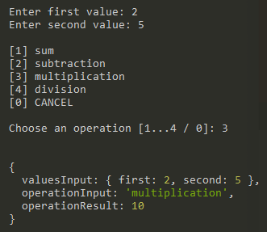

# Arithmetic Math

  

## Projeto

Um aplicativo via console que permite ao usuário calcular operações matemáticas básicas com valores de entrada selecionados usando a sincronização de linha de leitura.

## Tecnologias

Esse projeto foi desenvolvido com as seguintes tecnologias:

- [Node.js](https://nodejs.org/en/)

## Desenvolvimento

Foi utilizado o **[readlineSync](https://github.com/anseki/readline-sync)** para a sincronização interativa do usuário via console.

1. Instale o Node 12+
2. Clone este repositório
3. No terminal, digite `npm install` para instalar as dependências (*readline-sync*)
4. Depois, basta iniciar a aplicação com `npm start` 

## Licença

Esse projeto está sob a licença MIT. 

Feito por **[Juan Junger](https://www.linkedin.com/in/juan-junger/)**.​

